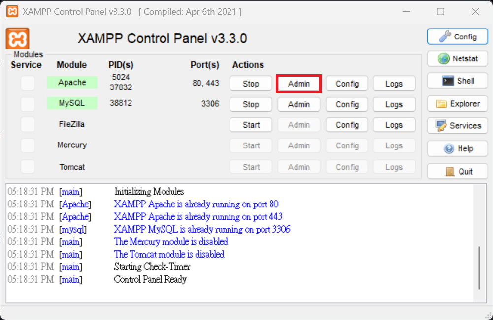
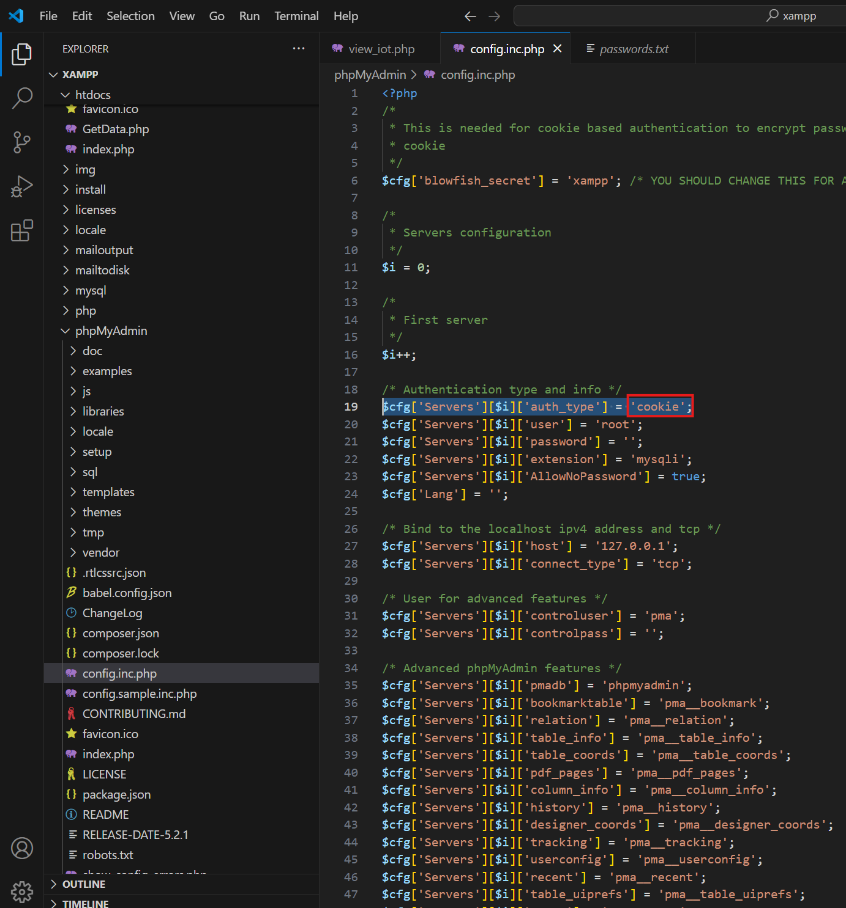
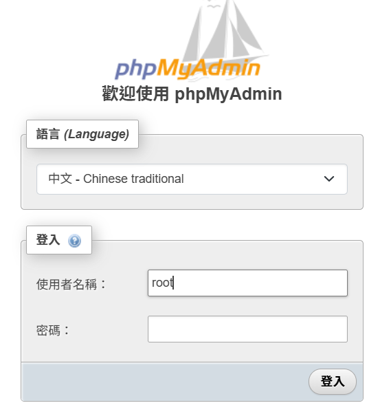
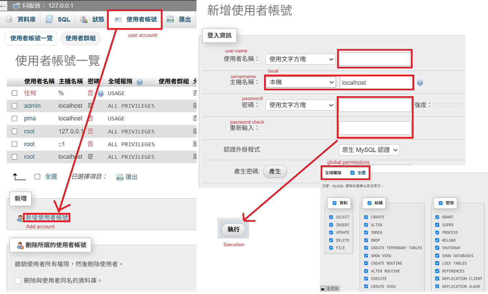
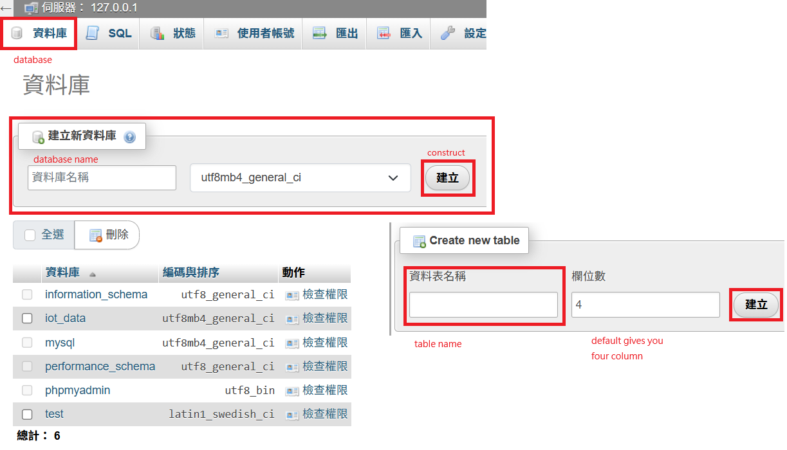
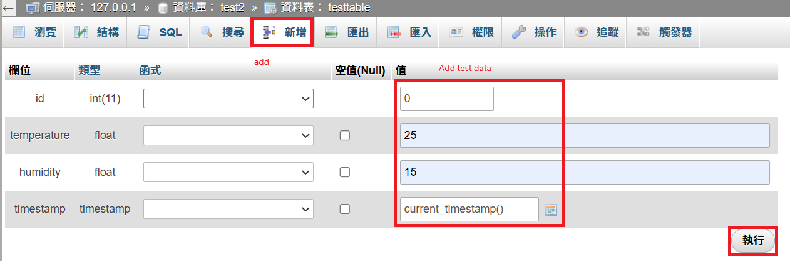
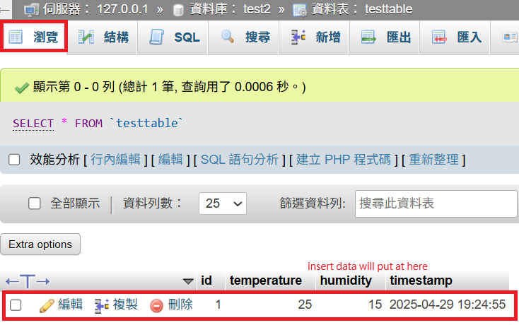

# 1132CFIOT2
- This implementation requires the server and database functions provided by XAMPP, combined with the temperature and humidity data read by the ESP32 used in CFIOT1, which will be transmitted back to the database.
## Hardware
First, you need those hardware to construct the environment.
- ESP32 * 1
- DHT11 * 1
- Dupont Line * 3
- USB to micro-USB wire * 1
## Software
Second, you need install some software to edit program:
- CH340 driver, for ESP32 connection.
- https://sparks.gogo.co.nz/ch340.html?srsltid=AfmBOopeMyIpntt-46BPMjZertXuS-KKUvQsJpbVBHTczKQMsF7IC7ft
- Arduino IDE, program development environment.
- https://www.arduino.cc/en/software/
- Visual Studio Code, for a better programming experience, it is recommended to download.
- https://code.visualstudio.com/download
- XAMPP, which have local server and database, we use it for contain our's data.
- https://www.apachefriends.org/download.html
> [!CAUTION]
> XAMPP will suggest you don't install in C:\ or C:\Program Files(x86), just follow the instruction.
### Hardware wiring diagram
By the code in Arduino, the pin have been setted.  
  
### Software setting
#### Arduino
We start from Arduino IDE:
- Add ESP32 board
  
- Add library  
  
#### XAMPP
And then we start to deal with XAMPP:
> [!WARNING]
> We only need to use the functions highlighted in the red box; the others can be unchecked.  
>   

- FileZilla FTP Server: Used for file transfer; this is required if users need to upload or download files.  
- phpMyAdmin: A graphical user interface for managing MySQL databases.  
- Webalizer: A program for recording and analyzing server logs.  
If you install successfully, open the XAMPP control panel, you should see this:
  
- To check XAMPP can work or not, you can tune on the Apache and MySQL:
  
- Click Admin under the Apache section in the control panel to check whether the default local web page can be accessed.
  
- If you see the page shown below, it means the server software is working properly.
  
- Next, check if MySQL is working properly. In the control panel, click Admin under the MySQL section to see if the MySQL dashboard opens successfully.
  
- And we have to set server's environment:
- First is change XAMPP's editer, original is Notepad, don’t open the file directly with it, as the code will appear all jumbled together.
- So we change it to VS code.
  
> [!WARNING]
>  You may face this problem  
>   
> This issue is caused by insufficient permissions in XAMPP. Open Windows File Explorer and navigate to the file "C:\xampp\xampp-control.ini".
> Right-click the file and select Properties from the context menu.  
>   

- Second, being able to access the database control panel directly during testing is very risky, as anyone using your computer can freely access the database.
- Therefore, we have to change the authentication method for accessing the database.
- Click Apche's config, you can open config file by VS code.
  
- auth_type refers to the authentication method. The default is config, but we need to change it to cookie.
- The difference is that config stores the username and password in config.inc.php and logs in automatically, while cookie uses database authentication for login, which is more secure.  
  
> [!CAUTION]
> After making the change, remember to save the file. Once saved, return to the XAMPP control panel and restart both Apache and MySQL.
> By rebooting, you should be able to access the MySQL control panel securely.  
>   
> After re-entering the MySQL control panel, a login window should appear.
> The default username is root, and the password is blank.

- Here is how to add an account:  
  
- Don't forget password.
- Third, let’s create a database.  
> [!WARNING]
> DO NOT USE UPPERCASE, the database would error.  

  
- Create the table, all the data will put in here and separate by name.  
  
- Here we can insert the data to test batabase are woring or not.
  
- You also can see the data from here:  
  
OK, we finally finish database construct.  
Next is Coding
#### Coding

